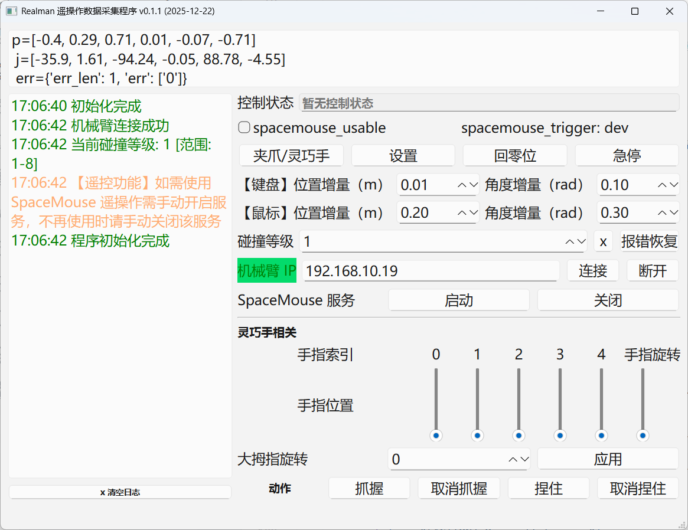

# realman 遥操作

## 主界面



## 环境配置

```sh
# 1、安装工具箱
pip install ./robot_toolbox-*.tar.gz

# 2、安装依赖
pip install -r requirements.txt

# 3、启动主程序
python -m realman_teleop
```

## 问题

## 安装 `pyaudio` 时报错

`Python src/pyaudio/device_api.c:9:10: fatal error: portaudio.h: 没有那个文件或目录`，解决：

```sh
sudo apt-get install libasound-dev portaudio19-dev libportaudio2 libportaudiocpp0
```
